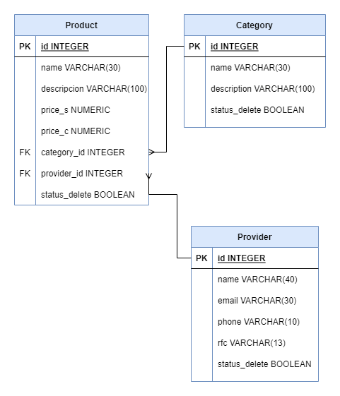
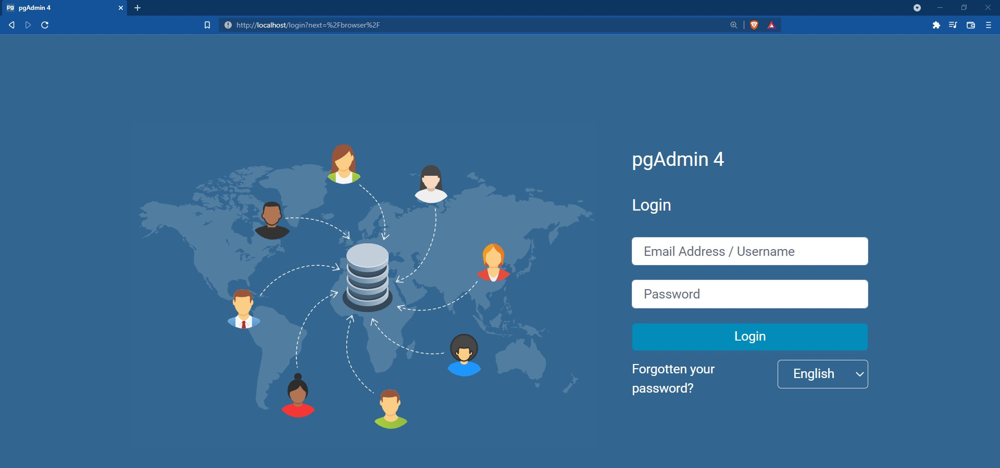
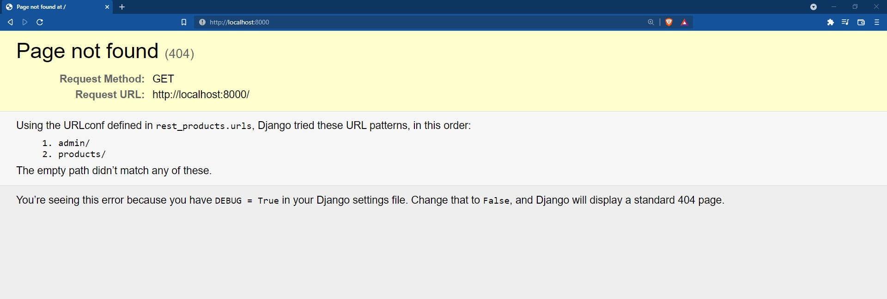

# RESTful API de Productos
RESTful API implementada con Django Rest Framework (DRF) | PostgreSQL | Docker | Compose y realizada para el taller de Future Developers.

____
### Planteamiento del problema
Desarrollar una RESTful API para el siguiente diagrama.



____
### Ejecución del proyecto

1. Accede a la carpeta rest_products.

2. Edita el archivo de variables de entorno .env en esta carpeta.

    ```txt
        SECRET_KEY='django-insecure-kuge#(eor61s=9_fxeycltf4i%%5mokt_0+e%s*n8xopy_1bbx'
        
        PORT=8000
        DEBUG=True

        DB_BACKEND=django.db.backends.postgresql
        DB_USERNAME=tuuser
        DB_PASSWORD=tupassword
        DB_NAME=products_db
        DB_PORT=5432
        DB_HOST=db

        PG_PORT=80
        PG_EMAIL=tucorreo@gmail.com
        PG_PASSWORD=chepe123
    ```
3. Construye los contenedores y ejecutalos. Solo la primera vez. 

    ```docker
    docker-compose up --build -d
    ```
5. Accede al contenedor app, para eso ejecuta el siguiente comando: 
    
    ```docker
    docker-compose exec -u root app /bin/bash
    ```

6. Crea las migraciones. 

    ```bash
    python manage.py makemigrations
    ```

7. Ejecuta las migraciones. 

    ```bash
    python manage.py migrate
    ```


8. Accede a http://localhost Vas a visualizar pg admin. 

    

9. Y si accedes a http://localhost:8000/ vas a visualizar el debug de django.

    

10. Ya puedes realizar las peticiones al API desde un cliente en localhost.

______
### Documentación 

Aquí está la documentación de la API en Postman.

[Documentación](https://www.postman.com/winter-eclipse-826659/workspace/api-talleres/collection/13319234-ba24b33a-6bd1-45c4-81d4-027f2324f526)

[](https://app.getpostman.com/run-collection/13319234-ba24b33a-6bd1-45c4-81d4-027f2324f526?action=collection%2Ffork&collection-url=entityId%3D13319234-ba24b33a-6bd1-45c4-81d4-027f2324f526%26entityType%3Dcollection%26workspaceId%3D442abbfb-0249-47d6-b7a9-fbefd8172a94)

____
### ¿Dudas?
Si tienes dudas, puedes contactarme por alguno de estos medios 🚀.

<a href = "https://www.linkedin.com/in/jos%C3%A9-%C3%A1ngel-garc%C3%ADa-garc%C3%ADa/"></a>

<a href = "https://twitter.com/ChepeAicrag12"></a>

<a href = "https://www.instagram.com/chepeaicrag/"></a>

<a href = "https://www.facebook.com/ChepeAicrag.0/"></a>


